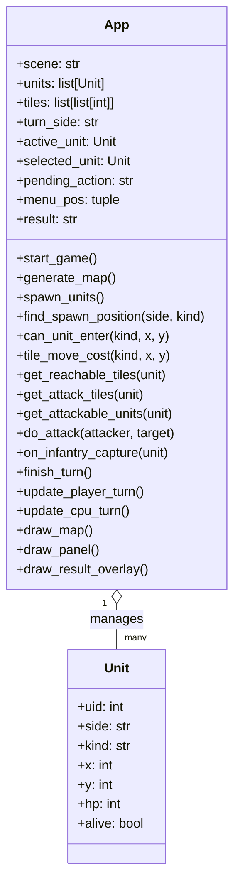
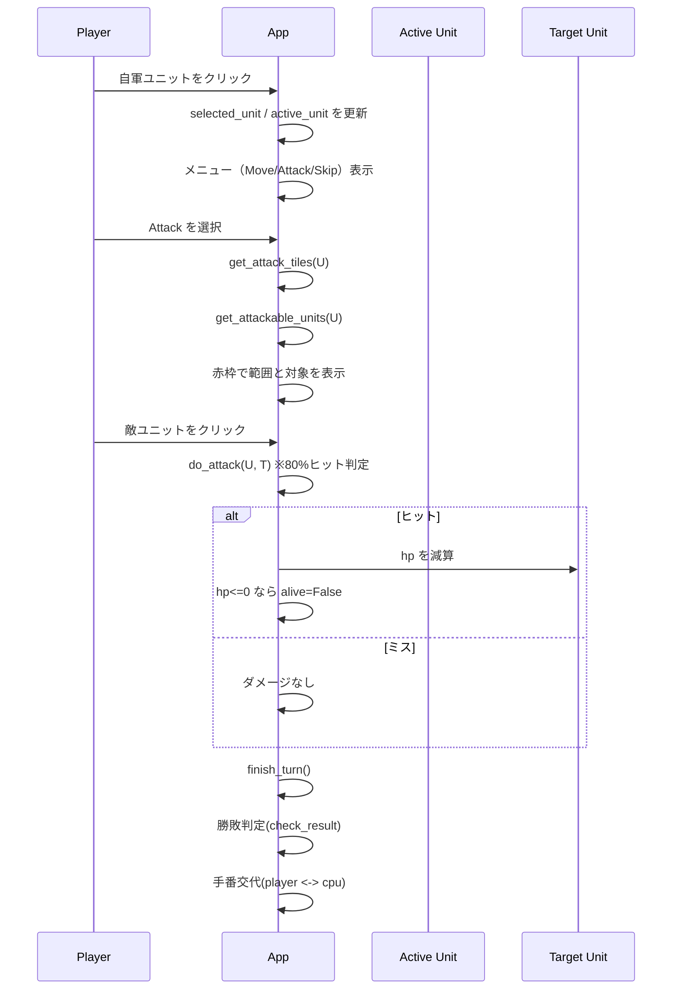

# レトロ戦術シミュレーションゲーム

Pyxel 製のターン制戦術シミュレーションゲームです。

## 必要環境

- Python 3.10 以上
- pyxel（`requirements.txt` を使ってインストール可能）

## インストール

```bash
pip install -r requirements.txt
```

## 起動方法

```bash
python app.py
```

## ゲーム概要

- 解像度：256x240
- 操作：マウス / タッチ
- マップ：1画面固定（11x15 タイル、16x16 px）
- ユニット名はタイル中央に表示
- ターン制：自軍から任意の1ユニットを選択して行動し、相手側へ交代
- ユニット選択後にカーソル近くに行動メニュー（移動 / 攻撃 / スキップ）が表示される
- 移動 / 攻撃時は対象範囲が赤枠で表示される
- 攻撃は 80% の確率でヒット
- ゲーム終了時は、その時点で占領している町の数が多い側が勝利（同数は引き分け）
- ゲーム終了条件：全町占領・一方全滅・一方の歩兵全滅

## ユニット一覧

| ユニット | 表示 | 移動 | 射程 | HP | 特徴 |
|---|---|---|---|---|---|
| 歩兵 | 兵 | 2 | 1 | 30 | 町を占領できる。水はコスト2で移動可 |
| 戦車 | 車 | 3 | 3 | 50 | 草原・森を移動可（森はコスト2） |
| 戦闘機 | 飛 | 5 | 3 | 10 | どこでも移動可。飛行機・艦船のみ攻撃可 |
| 艦船 | 艦 | 2 | 5 | 50 | 水のみ移動可 |

## .pyxapp のビルド

```bash
pyxel package . app.py
```

生成ファイル：`retro_sim_game.pyxapp`

## Pyxel Web Launcher での起動

以下の URL を開くと、ブラウザ上で本アプリを直接起動できます。

https://kitao.github.io/pyxel/wasm/launcher/?play=zencha201/retro_sim_game/main/retro_sim_game&gamepad=enabled

## 実装構成図（Mermaid）

### クラス構成



### 主要シーケンス（プレイヤー攻撃ターン）


